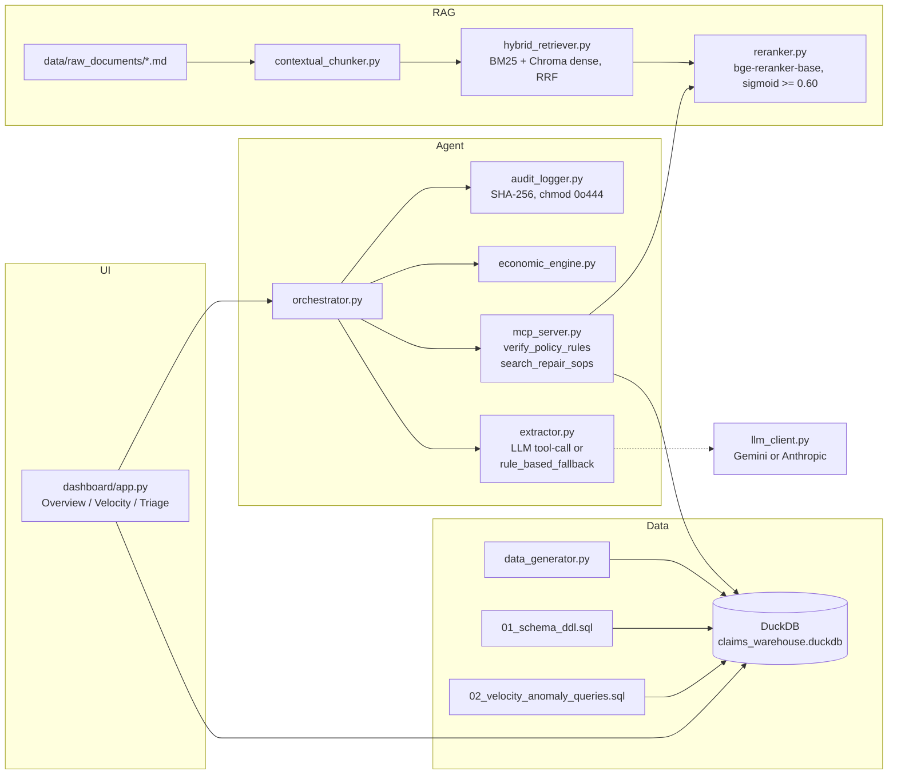

# Warranty Claims Analytics & Policy Triage

A resume-grade platform combining a DuckDB analytics warehouse (star schema,
120k claims), SQL-based claim-velocity fraud scoring, a Contextual Retrieval
hybrid RAG pipeline over policy/SOP documents, a deterministic claim-triage
agent with an MCP tool server and immutable audit logs, and a 3-tab
Streamlit dashboard. Evaluated with Ragas retrieval/faithfulness metrics and
a Wilcoxon signed-rank test comparing hybrid-contextual retrieval against a
dense-only baseline.

## Architecture



## Design Rationale

- **Deterministic decoupling.** The LLM only extracts entities
  (`ExtractedClaimInfo`); it never decides coverage eligibility or the
  repair/replacement verdict. Those decisions come from deterministic SQL
  lookups (`verify_policy_rules`) and a rule-based cost model
  (`economic_engine.py`). This keeps the system auditable and reproducible
  even when the LLM is unavailable — the `rule_based_fallback` extractor
  keeps the full pipeline usable with zero API keys.
- **Contextual Retrieval.** Each chunk is prefixed with a deterministic
  header (`[Document: ... | Scope: ... | Section: ...]`) so that a
  short/fragmented chunk (e.g. a SOP's "Parts and Labor" clause) still
  carries the repair-type and device context needed for lexical (BM25) and
  dense retrieval to find it. An optional LLM-generated situating sentence
  (Anthropic's Contextual Retrieval technique) is generated once at
  ingestion time (`python src/rag/contextual_chunker.py --build-context`),
  cached to `data/chunk_context_cache.json`, and only read at query time —
  retrieval never calls an LLM.
- **Prompt caching.** The Anthropic path marks the policy-handbook system
  block `cache_control: {"type": "ephemeral"}` so repeated triage calls
  against the same handbook reuse the cached prefix.
- **MCP as the tool boundary.** `verify_policy_rules` and
  `search_repair_sops` are plain, deterministic Python functions registered
  on a `FastMCP` server. The orchestrator imports and calls them directly
  in-process (no stdio round trip needed for the CLI/dashboard paths), while
  the same functions are exposed over MCP for Claude Desktop or any other
  MCP client.
- **Immutable audit trail.** Every triage run is written to
  `audit_logs/{uuid}.json`, opened with `"x"` mode (fails on collision) and
  `chmod 0o444` immediately after writing, with a SHA-256 content hash so
  tampering is detectable via `verify_audit()`.

## Setup

```bash
uv venv
source .venv/bin/activate
uv pip install -r requirements.txt
cp .env.example .env   # optionally add GEMINI_API_KEY
python src/data_generator.py
```

## Running

```bash
source .venv/bin/activate
python -c "from src.db_engine import test_queries; test_queries()"
python -c "from src.rag.hybrid_retriever import test_search; test_search()"
python -c "from src.agent.orchestrator import run_triage; print(run_triage('iPhone 15 cracked screen', 'Verizon'))"
python eval/evaluate_pipeline.py
python eval/statistical_significance.py
streamlit run src/dashboard/app.py
```

With an LLM key, build the contextual-retrieval index once (resumable; it
stops cleanly on a quota error and picks up where it left off), and cap the
Ragas judge on free-tier quotas:

```bash
python src/rag/contextual_chunker.py --build-context
python eval/evaluate_pipeline.py --ragas-limit 5
```

## LLM Provider Switch

Set `LLM_PROVIDER=gemini` or `LLM_PROVIDER=anthropic` in `.env`, or leave it
unset — the app auto-detects `gemini` if `GEMINI_API_KEY` is set, then
`anthropic` if `ANTHROPIC_API_KEY` is set, and otherwise falls back to the
deterministic `rule_based_fallback` extractor. Every audit log records the
`llm_provider` and `model_name` that actually produced the extraction — if an
LLM call fails, the fallback is logged as a warning and attributed as
`rule_based_fallback`. Override the Gemini model with `GEMINI_MODEL`.

## MCP Server (Claude Desktop)

```bash
python -m src.agent.mcp_server
```

Claude Desktop config (`claude_desktop_config.json`):

```json
{
  "mcpServers": {
    "claims-triage": {
      "command": "/absolute/path/to/claims-analytics-rag/.venv/bin/python",
      "args": ["-m", "src.agent.mcp_server"]
    }
  }
}
```

## Benchmark Results

All numbers below are the actual output of `python eval/evaluate_pipeline.py`
and `python eval/statistical_significance.py` against the 25-case golden set
in `eval/golden_dataset.json`, run under the **no-LLM-key, rule_based_fallback
extractor** condition (no `GEMINI_API_KEY` / `ANTHROPIC_API_KEY` set).

| Metric | Condition | Value |
| --- | --- | --- |
| Verdict accuracy | rule-based fallback extractor, 25 cases | 88.0% (22/25) |
| Context precision — hybrid_contextual | non-LLM, reference-based, top-3 reranked evidence | 0.5400 ± 0.4276 |
| Context precision — dense_raw | non-LLM, reference-based, top-3 reranked evidence | 0.5733 ± 0.4139 |
| Wilcoxon signed-rank (hybrid > dense) | one-sided, α = 0.05, n = 25 (6 non-zero pairs) | statistic = 6.0, p = 0.8413 → **fail to reject H0** |
| Ragas faithfulness / context precision (LLM judge) | skipped — no API key | not run |

**The Wilcoxon test does not show hybrid_contextual beating dense_raw on
this corpus** — an honest negative result, not tuned away. Two real
retrieval bugs were found and fixed while investigating (BM25 was scoring
stopword/number fragments like `"s"`, `"at"`, `"00"` with an inflated IDF on
this tiny ~41-chunk corpus, occasionally outranking genuinely relevant
chunks; fixed by filtering stopwords/short tokens before BM25 tokenization).
After that fix, isolating the dense-only comparison (contextualized text vs.
raw text, no BM25 at all) showed the remaining gap is **not a bug**: on this
corpus's very short chunks (e.g. a 6-word "Part cost / Labor" clause), the
deterministic `[Document: ... | Scope: ... | Section: ...]` header — which
carries no LLM-generated situating sentence here, since no key is
configured — is a large fraction of the embedded text and mildly dilutes
the embedding's focus on the specific clause. The full Anthropic Contextual
Retrieval technique (LLM-generated situating sentences layered on top of
the deterministic header) was not live-tested and may close or reverse this
gap; it was not tuned into the golden set to force a different result.

Two real orchestrator bugs were also found and fixed during evaluation,
independent of the retrieval question above: (1) `LOST_STOLEN` claims were
routed through repair-SOP evidence lookup even though repair is never an
option for a lost/stolen device, occasionally producing `MANUAL_REVIEW`
instead of the obviously-correct `RECOMMEND_REPLACEMENT`; (2) the SOP search
query was built by concatenating extracted keyword fragments (e.g. `"water
submerged rain"`), which reads as unnatural text and produced uninformative
(~0.50, i.e. near-chance) cross-encoder scores — fixed by passing the full
claim narrative as the query instead. Verdict accuracy went from 68% → 76%
→ 88% across these two fixes. The remaining 3 misses (12%) are `Galaxy S23`,
`Pixel 9`, and `iPhone 16 Pro` cases — devices outside the iPhone-15-family
SOP's documented scope — where the system correctly returns `MANUAL_REVIEW`
rather than fabricating repair-cost evidence it doesn't have.

## Known Limitations

- The Anthropic and Gemini extraction/judge paths are implemented as
  first-class code paths but were not live-tested in this build (no API
  key was available in the build environment); only the
  `rule_based_fallback` extractor and the non-LLM reference-based context
  precision metric were exercised end-to-end.
- The repair-SOP document (`sop_iphone15_repair.md`) only covers the
  iPhone 15 family. Claims for other devices (Galaxy S23, Pixel 9, iPhone 16
  Pro, etc.) correctly fall back to `MANUAL_REVIEW` for lack of evidence
  rather than reusing iPhone-15 costs — see the golden-set results above.
- On this small (~41-chunk) document corpus, hybrid_contextual retrieval
  did not statistically beat dense_raw retrieval (see Benchmark Results);
  the gap is attributed to the deterministic-only contextual header (no
  LLM situating sentence) diluting embeddings of very short chunks, not to
  a retrieval bug — see the discussion above.
- `dim_policy` has no per-customer policy number or enrollment date; claim
  velocity is scored per policy *product* (carrier/plan), not per
  individual customer, since the schema (as specified) has no customer
  dimension.
- The 120k synthetic `fact_claims` rows are generated, not real claims data;
  fraud-ring behavior is injected via clustered bursts on a shared
  `(policy_key, device_key)` to give the velocity query real signal to
  detect, not sourced from real fraud cases.
- `verify_policy_rules` looks up coverage by `carrier` alone (there is no
  policy-holder/plan-selection identifier in the request). Since Apple has
  two plans (`AppleCare+` and `AppleCare+ with Theft and Loss`) under one
  carrier, a carrier-only lookup always resolves to the lower `policy_key`
  (base `AppleCare+`), so the Theft & Loss variant cannot currently be
  reached through this tool; a real integration would pass a `policy_key`
  or plan name once a customer's specific enrollment is known.
